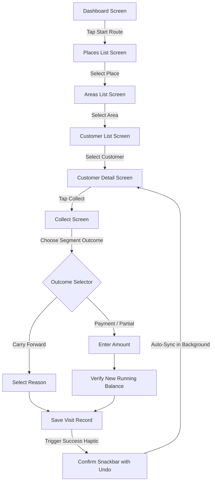

# System Tokens (Colors, Typography, Spacing)

This section documents the foundational design tokens implemented in the application theme layer (`lib/core/theme/`).

## Color Palette

The color system uses a warm paper base coupled with high-contrast functional accent colors to optimize readability on low-end screens in bright outdoor conditions. 

### Light Mode (`AppColors.light`)
*   **Background**: `#F8F5EE` (Warm off-white paper base)
*   **Foreground**: `#1B1F2A` (Deep slate for body text)
*   **Surface**: `#FFFFFF` (Pure white card containers)
*   **Primary**: `#0F5D6B` (Deep teal for primary actions and highlights)
*   **PrimaryFg**: `#F2FBFC` (High-contrast light blue text for buttons)
*   **Accent**: `#F2C88C` (Warm sand accent)
*   **Success**: `#1F8A5B` (Currency green for payments/completed actions)
*   **Warning**: `#D98A2B` (Marigold for partial payments/alerts)
*   **WarningFg**: `#3A2408` (Dark brown text on marigold backgrounds)
*   **Danger/Destructive**: `#C0392B` (Vermilion for overdue outstanding and delete actions)
*   **Muted**: `#EFEBE1` (Soft gray-brown for inactive backgrounds/segmented switches)
*   **MutedFg**: `#6C6F78` (Muted slate for secondary captions)
*   **Border**: `#E3DED2` (Light beige divider line color)

### Dark Mode (`AppColors.dark`)
*   **Background**: `#0F1417` (Deep dark slate background)
*   **Foreground**: `#ECEEF0` (Bright white-gray body text)
*   **Surface**: `#171D22` (Dark gray card containers)
*   **Primary**: `#3ABDD0` (Vibrant light teal for high contrast)
*   **PrimaryFg**: `#0A2A30` (Dark teal text on light teal buttons)
*   **Accent**: `#E0A850` (Vibrant sand accent)
*   **Success**: `#34D399` (Vibrant mint green)
*   **Warning**: `#F5B04A` (Vibrant marigold)
*   **WarningFg**: `#FFF8E1` (Light warm sand text)
*   **Danger/Destructive**: `#EF5350` (Vibrant vermilion)
*   **Muted**: `#2A2D35` (Muted gray-blue)
*   **MutedFg**: `#9CA3AF` (Light gray secondary text)
*   **Border**: `#2A3138` (Dark gray divider line color)

---

## Typography Scale

The font system combines **Plus Jakarta Sans** (clean geometric sans-serif for display/headers) with **Space Grotesk** (tabular figure features for high-readability currency grids).

### Display Font: Plus Jakarta Sans
*   **Display Large**: 32sp | Bold (w700) | Line Height 1.2
*   **Display Medium**: 28sp | Semi-Bold (w600) | Line Height 1.25
*   **Headline Large**: 22sp | Bold (w700) | Line Height 1.3
*   **Headline Medium**: 20sp | Semi-Bold (w600) | Line Height 1.3
*   **Headline Small**: 18sp | Semi-Bold (w600) | Line Height 1.33
*   **Title Large**: 17sp | Semi-Bold (w600) | Line Height 1.35
*   **Title Medium**: 17sp | Medium (w500) | Line Height 1.35
*   **Title Small**: 15sp | Semi-Bold (w600) | Line Height 1.4
*   **Body Large**: 15sp | Regular (w400) | Line Height 1.5
*   **Body Medium**: 15sp | Regular (w400) | Line Height 1.5
*   **Body Small**: 13sp | Regular (w400) | Line Height 1.5
*   **Caption**: 12sp | Medium (w500) | Line Height 1.4
*   **Overline**: 11sp | Semi-Bold (w600) | Line Height 1.4 | Letter Spacing +0.5dp
*   **Label Large**: 14sp | Semi-Bold (w600) | Line Height 1.4
*   **Label Medium**: 12sp | Medium (w500) | Line Height 1.4
*   **Label Small**: 11sp | Medium (w500) | Line Height 1.4

### Numeric Font: Space Grotesk (Tabular Figures enabled)
*   **Currency Large**: 32sp | Bold (w700) | Line Height 1.2 | Letter Spacing -0.02em
*   **Currency Medium**: 24sp | Semi-Bold (w600) | Line Height 1.25 | Letter Spacing -0.02em
*   **Currency Small**: 17sp | Semi-Bold (w600) | Line Height 1.3 | Letter Spacing -0.02em

---

## Shape (Border Radii)
*   **Small (`sm`)**: `8dp` — For chips, small badges, and segment buttons.
*   **Medium (`md`)**: `12dp` — For text input fields and standard segment containers.
*   **Large (`lg`)**: `16dp` — For primary cards, list items, and modal sheets.
*   **Extra Large (`xl`)**: `24dp` — For hero panels and large widgets.
*   **Full (`full`)**: `999dp` — For rounded avatars, badges, and circular button shapes.

---

## Spacing Scale
A consistent linear vertical and horizontal spacing system.
*   **`xs`**: `4dp`
*   **`sm`**: `8dp`
*   **`md`**: `12dp`
*   **`lg`**: `16dp`
*   **`xl`**: `20dp`
*   **`xxl`**: `24dp`
*   **`xxxl`**: `32dp`

---
---

# Global Reusable Widgets

This section catalogs shared components located under `lib/core/widgets/`.

### 1. `AmountText`
*   **Description**: Renders semantic currency format using Indian Rupees (`en_IN` grouping, e.g. ₹12,00,000). Includes screen-reader accessibility labels.
*   **Parameters**:
    *   `amount` (int): Required. Monetary value in Rupees.
    *   `style` (TextStyle?): Optional. Font style (defaults to `AppTypography.currencyMedium`).
    *   `useSemanticLabel` (bool): Optional. Enables spoken accessibility string (defaults to `true`).

### 2. `AppScaffold`
*   **Description**: Standardized page shell. Binds status indicators, floating bottom buttons, navigation back-stacks, and safe area padding.
*   **Parameters**:
    *   `title` (Widget): Required. App bar title.
    *   `body` (Widget): Required. Core scrollable page layout.
    *   `appBarActions` (List<Widget>?): Optional. App bar right-hand actions.
    *   `bottomSheetSlot` (Widget?): Optional. Sticky bottom action bar.
    *   `blendHeader` (bool): Optional. Blends header background into the scaffold (defaults to `false`).
    *   `showSyncIndicator` (bool): Optional. Visualizes pending sync states (defaults to `true`).

### 3. `Avatar`
*   **Description**: Rounded initial-based customer identity widget.
*   **Parameters**:
    *   `initials` (String): Required. First letter of names.
    *   `radius` (double): Optional. Circular width/height (defaults to `22dp`).

### 4. `BreadcrumbsBar`
*   **Description**: Linear breadcrumbs line indicator for visual navigation state (e.g. `Monday` → `Melur` → `North Street`).

### 5. `ConfirmSnackbar`
*   **Description**: Multi-purpose floating indicator toast with a built-in 5-second `UNDO` action callback.

### 6. `EmptyState`
*   **Description**: Centered illustration container displaying friendly empty list warnings (e.g. "No dues here 🌿" or "Enjoy the day off").
*   **Parameters**:
    *   `message` (String): Required.
    *   `icon` (IconData?): Optional.

### 7. `ErrorState`
*   **Description**: Display block for failed operations.
*   **Parameters**:
    *   `message` (String): Required.
    *   `onRetry` (VoidCallback): Required.

### 8. `FloatingBottomNav`
*   **Description**: Glassmorphic pill-shaped navigation bar anchored 12dp above the phone screen edge with background blur.
*   **Parameters**:
    *   `selectedIndex` (int): Active tab index (0: Dashboard, 1: Inventory, 2: Transactions, 3: Clients).
    *   `onTap` (Function(int)): Click router listener.

### 9. `LoadingSkeleton`
*   **Description**: Grey shimmer containers representing list items during loading.

### 10. `SectionHeader`
*   **Description**: Segment heading dividers with optional trailing action links.
*   **Parameters**:
    *   `title` (String): Required.
    *   `actionLabel` (String?): Optional.
    *   `onActionTap` (VoidCallback?): Optional.

### 11. `StatCard`
*   **Description**: Dual-row card container displaying a semantic value (rupees/numbers) and caption.
*   **Parameters**:
    *   `label` (String): Metric name.
    *   `value` (dynamic): Rupee amount or counter.
    *   `subValue` (String?): Bottom sub-label.

### 12. `SyncStatusIndicator`
*   **Description**: Top-bar action button showing local database synchronization progress (`Synced` / `Offline` / `N pending`).

### 13. `TagChip`
*   **Description**: Colored badges mapped to specific collection visit outcomes.
*   **Parameters**:
    *   `type` (TagType): Enum value (`pending`, `inProgress`, `done`, `partial`, `carryForward`, `noOutstanding`).
    *   `customLabel` (String?): Overriding display string.

### 14. `ThemeToggleButton`
*   **Description**: Toggle switch to swap between light and dark modes.

---
---

# Application Information Architecture (Screen list and specs)

Catalog of all structural screen layouts mapped in `lib/features/`.

## S1. Splash Screen (`/splash`)
*   **Purpose**: Startup synchronization check.
*   **Structural Anatomy**:
    *   Centered App Logo
    *   Loading Spinner
    *   Offline Local Cache verification trigger.

## S2. Dashboard Screen (`/`)
*   **Purpose**: Immediate status check of the collector's daily route.
*   **Structural Anatomy**:
    *   **AppBar**: Greeting title ("Good Morning") + `ThemeToggleButton`
    *   **Body Layout**:
        *   `WeekdayScroller`: 7-day horizontal scroll selector (defaults to current day).
        *   `HeroOutstandingCard`: Highlights total expected collections, progress bar of collected cash, and a primary button to "START ROUTE".
        *   `Stats Row`: 2-column metrics displaying `Total Outstanding` (company-wide) and `Dues Collected` (today).
        *   `QuickActionsRow`: Horizontal icon grid (Collect, New Sale, New Client, Inventory).
        *   `Route Locations List`: Cards for today's place targets showing pending customers and total outstanding.
        *   `Recent Transactions List`: Stack of latest activities recorded locally.
    *   **Navigation**: Uses `FloatingBottomNav` at the footer.

## S3. Weekday Screen (`/weekday/:day`)
*   **Purpose**: View places schedule on any given day.
*   **Structural Anatomy**:
    *   **AppBar**: Custom title containing day name + Back button.
    *   **Body Layout**:
        *   `PlaceTile` list (Melur, Othakadai, etc.) containing area count, customer counts, sum of outstanding dues, and visual collections progress bars.

## S4. Place Screen (`/weekday/:day/place/:placeId`)
*   **Purpose**: Navigate to distinct areas within a specific place.
*   **Structural Anatomy**:
    *   **AppBar**: Breadcrumbs showing Day → Place.
    *   **Header**: Area progress strip (Outstanding target, collected today, pending customers).
    *   **Body Layout**:
        *   `AreaTile` list (North Street, Bazaar Lane) showing customers completed vs total.

## S5. Area Screen (`/weekday/:day/place/:placeId/area/:areaId`)
*   **Purpose**: Locate and select a customer.
*   **Structural Anatomy**:
    *   **AppBar**: Area name title.
    *   **Body Layout**:
        *   Search input field.
        *   `CustomerTile` list sorted by overdue status and outstanding amount.
        *   Tiles display: Initial Avatar, Name, Phone Number, Outstanding dues, last visited date, and overdue flag badges.

## S6. Customer Detail Screen (`/weekday/:day/place/:placeId/area/:areaId/customer/:customerId`)
*   **Purpose**: 360-degree client file review and quick action trigger.
*   **Structural Anatomy**:
    *   **AppBar**: Customer Name.
    *   **Body Layout**:
        *   `CustomerContextCard`: Profile card with quick action triggers (Tap-to-call phone launcher, spouse/guardian name, nominee details, and uploaded ID proofs).
        *   `FinancialSummaryBlock`: Highlights total active dues.
        *   `Unified Activity History`: Chronological timeline of sales and collection payments.
    *   **Bottom Action Bar**: Pinned buttons for `NEW SALE` (outlined teal) and `COLLECT` (filled teal).

## S7. Collect Screen (`/customer/:customerId/collect`)
*   **Purpose**: Log a collection visit outcome.
*   **Structural Anatomy**:
    *   **AppBar**: "New Collection Visit"
    *   **Body Layout**:
        *   Customer Context strip.
        *   `OutcomeSegmentedSelector`: Horizontal selector button group (PAYMENT / PARTIAL / CARRY FWD).
        *   `AmountInputField`: Numeric amount input with currency prefix icon (hidden when CARRY FWD is selected).
        *   `QuickAmountChipsRow`: Rapid increment chips (`+ ₹100`, `+ ₹500`, `+ ₹1,000`, `Clear`).
        *   `QuickReasonChipsRow`: Quick reason selections for Carry Forward outcomes (`Not at Home`, `Will pay in evening`, `No Cash Available`, `Shop Closed`).
        *   `Remarks`: Text field for custom note entries.
        *   `Live Outstanding Preview`: Box calculating current dues minus entered collection cash, outputting the new balance.
    *   **Bottom Action Bar**: Pinned "SAVE VISIT RECORD" primary button.

## S8. Sale Screen (`/customer/:customerId/sale`)
*   **Purpose**: Book new appliance purchase and finance credits.
*   **Structural Anatomy**:
    *   **AppBar**: "Record Home Appliance Sale"
    *   **Body Layout**:
        *   Customer details card.
        *   `LineItemsSection`: Lists chosen products, custom quantities, and custom price edits. Includes a button to launch the `ProductPickerBottomSheet`.
        *   `AdvanceInputField`: Downpayment cash amount input.
        *   `Remarks`: Optional sales notes.
        *   `Financial Calculations Card`: Sums total item prices, subtracts downpayments, displays credit added, derived sale classification (`READY` vs `CREDIT`), and calculates new customer outstanding running balance.
    *   **Bottom Action Bar**: Pinned "RECORD COMPLETED SALE" primary button.

## S9. Product Picker (Bottom Sheet)
*   **Purpose**: Select products from the store catalog.
*   **Structural Anatomy**:
    *   Search field filtering by Product Name, Brand, or SKU.
    *   Vertical product cards showing SKU, stock levels, unit price, and prominent "OUT OF STOCK" error indicators.

## S10. Inventory Categories Screen (`/inventory`)
*   **Purpose**: Browse store stock departments.
*   **Structural Anatomy**:
    *   Category cards showing department icon (Kitchen, Laundry, Audio, Lighting, Cooling) and product variety counters.

## S11. Inventory Products Screen (`/inventory/:categoryId`)
*   **Purpose**: View stock status.
*   **Structural Anatomy**:
    *   Filterable stock grid showing SKU, brand, available stock count, and critical low-stock alert badges when stock falls below the minimum threshold.

## S12. Transactions Screen (`/transactions`)
*   **Purpose**: Master audit trail of recent entries.
*   **Structural Anatomy**:
    *   Daily grouped feed list displaying all payments, partials, carry forwards, and sales with transaction metadata.

## S13. Clients Screen (`/profile`)
*   **Purpose**: Directory of all registered customer files.
*   **Structural Anatomy**:
    *   Searchable list of client cards showing codes, locations, status tags, and outstanding dues.

## S14. New Client Screen (`/customer/new`)
*   **Purpose**: Create a new customer file.
*   **Structural Anatomy**:
    *   Fields: Customer Name, Phone, Guardian/Spouse, Full Address, Landmark, Nominees (Name, Relation, Phone), ID Proof Selector, and Location Coordinates.

---
---

# User Flows & Interaction Rules

## 1. Core Field Collection Flow

---

## 2. Business Rules & Financial Mathematics

### Rule 2.1: Unified Outstanding Balance
*   **Rule**: Customer accounts maintain a single outstanding balance running sum. No EMIs or individual products are tracked separately.
*   **Math**: 
    $$\text{New Running Balance} = \text{Current Outstanding} + \text{Credit Added} - \text{Collected Cash}$$

### Rule 2.2: Collection Outflow Deductions
*   **PAYMENT Outcome**: Collected Cash is entered. Dues are reduced.
*   **PARTIAL_PAYMENT Outcome**: Collected Cash is entered (must be less than current dues). Dues are reduced. Remarks are required.
*   **CARRY_FORWARD Outcome**: Collected Cash is always zero. Dues are unmodified. Remarks/Reasons are mandatory.

### Rule 2.3: Sale Type Classification (Derived Value)
*   **Rule**: Sales are dynamically classified as either ready cash sales or financed credit sales depending on downpayments.
*   *   $\text{Credit Added} = \text{Total Purchase Value} - \text{Downpayment Received}$
    *   If $\text{Credit Added} = 0$, Sale Type is classified as **`READY`**.
    *   If $\text{Credit Added} > 0$, Sale Type is classified as **`CREDIT`**.

---

## 3. Accessibility & Usability Standards
*   **One-Thumb Targets**: Interactive elements (buttons, segment selectors, list tiles) maintain a minimum heights/widths of **56dp** to facilitate walking usage.
*   **Numeric Input Optimization**: Custom input fields open a numeric dialer layout automatically with rupee suffixes.
*   **Accessibility Labels**: Spoken currencies (e.g. `$amount rupees`) are mapped onto semantic text containers.
*   **Success Haptics**: Success alerts fire `HapticFeedback.lightImpact` or `mediumImpact` on saving transactions.

---
---

# Dynamic Mock Data Bundles

This section lists the static structural mock data seeding the prototype layers.

## 1. Route Structures
*   **Weekdays**: Monday (`w-1`), Tuesday (`w-2`), Wednesday (`w-3`), Thursday (`w-4`), Friday (`w-5`), Saturday (`w-6`), Sunday (`w-7`).
*   **Places**:
    *   `Melur` (Thursday Route `w-4`)
    *   `Othakadai` (Thursday Route `w-4`)
    *   `Goripalayam` (Monday Route `w-1`)
    *   `Thirunagar` (Tuesday Route `w-2`)
*   **Areas**:
    *   `North Street` (Melur Place `p-1`)
    *   `Bazaar Lane` (Melur Place `p-1`)
    *   `NH Colony` (Othakadai Place `p-2`)
    *   `Mosque Road` (Goripalayam Place `p-3`)
    *   `Station Road` (Thirunagar Place `p-4`)

---

## 2. Customer Database Profiles
*   **Lakshmi Priya (`c-1`)**: Active. Address: North Street, Melur. Guardian: Ramanathan (Spouse). Note: "Always pays in morning. Likes Prestige brand."
*   **Muthu Pandian (`c-2`)**: Active. Address: Bazaar Lane, Melur. Guardian: Chinnasamy (Father). Note: "Busy during noon. Call before visiting."
*   **Anitha Rajendran (`c-3`)**: Active. Address: NH Colony, Othakadai. Guardian: Rajendran (Spouse). Note: "Check back after 5 PM."
*   **Karthik Raja (`c-4`)**: Active. Address: Mosque Road, Goripalayam. No dues outstanding.
*   **Selvi Murugesan (`c-5`)**: Flagged / Do Not Visit. Address: Station Road, Thirunagar. Guardian: Murugesan (Spouse). Note: "Payment dispute. Flagged do not visit."
*   **Rahim Khan (`c-6`)**: Active. Address: Mosque Road, Goripalayam. Small outstanding.
*   **Meena Subramanian (`c-7`)**: Active. Address: North Street, Melur. Newly added customer.
*   **Venkatesan Alagar (`c-8`)**: Active. Address: NH Colony, Othakadai. Prefers credit sales.

---

## 3. Product Store Catalog
*   **Kitchen Appliances** (`cat-kat`):
    *   Prestige Mixer Grinder 3 Jar (`pr-1` | ₹3,200 | Stock: 12)
    *   Philips Induction Cooktop HD4928 (`pr-2` | ₹2,800 | Stock: 8)
    *   Vidiem 2-Slice Toaster (`pr-3` | ₹950 | Stock: 15)
    *   Black+Decker Electric Kettle 1L (`pr-4` | ₹750 | Stock: 3)
    *   Preethi Blender 750W (`pr-5` | ₹1,850 | Stock: 0 - OUT OF STOCK)
    *   IFB Microwave Oven 20L (`pr-6` | ₹4,500 | Stock: 5)
*   **Laundry** (`cat-laundry`):
    *   IFB 7Kg Front Load Washing Machine (`pr-7` | ₹28,500 | Stock: 3)
    *   LG 8Kg Fully Automatic Top Load (`pr-8` | ₹22,000 | Stock: 2)
    *   Godrej Semi-Auto Washing Machine 6.5Kg (`pr-9` | ₹6,800 | Stock: 8)
    *   Usha Dry Iron 1000W (`pr-10` | ₹850 | Stock: 25)
    *   Philips Steam Iron 2000W (`pr-11` | ₹1,450 | Stock: 12)
    *   Agaro Fabric Steamer (`pr-12` | ₹1,200 | Stock: 0 - OUT OF STOCK)
*   **Home Audio** (`cat-audio`):
    *   boAt Stone 1200 Speaker 30W (`pr-13` | ₹3,490 | Stock: 18)
    *   JBL Go 3 Portable Speaker (`pr-14` | ₹2,490 | Stock: 22)
    *   Sony WH-CH720N Wireless Headphones (`pr-15` | ₹6,490 | Stock: 9)
    *   Soundcore Space A40 Earbuds (`pr-16` | ₹4,490 | Stock: 4)
    *   One Plus Soundbar 20W (`pr-17` | ₹7,990 | Stock: 0 - OUT OF STOCK)
    *   Rode NT-USB Mini Microphone (`pr-18` | ₹890 | Stock: 7)
*   **Lighting** (`cat-lighting`):
    *   Philips LED Bulb 9W B22 (`pr-19` | ₹125 | Stock: 120)
    *   Godrej LED Bulb 12W E27 (`pr-20` | ₹145 | Stock: 95)
    *   RGB LED Strip Lights 5M (`pr-21` | ₹890 | Stock: 25)
    *   LED Tube Light 2ft 18W (`pr-22` | ₹350 | Stock: 8)
    *   LED Desk Lamp 12W (`pr-23` | ₹1,250 | Stock: 3)
    *   Wipro Smart LED Bulb WiFi (`pr-24` | ₹1,890 | Stock: 0 - OUT OF STOCK)
*   **Cooling** (`cat-cooling`):
    *   Orient Electric Ceiling Fan 400RPM (`pr-25` | ₹2,450 | Stock: 11)
    *   Havells Table Fan 1200mm (`pr-26` | ₹1,850 | Stock: 19)
    *   LG 1 Ton 3-Star Air Conditioner (`pr-27` | ₹22,000 | Stock: 2)
    *   Carrier 1 Ton 5-Star AC (`pr-28` | ₹26,500 | Stock: 1)
    *   Boss Tower Air Cooler 45L (`pr-29` | ₹4,850 | Stock: 0 - OUT OF STOCK)
    *   Portable USB Fan Mini (`pr-30` | ₹390 | Stock: 45)
